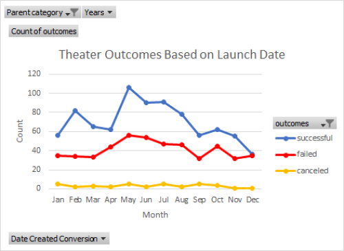
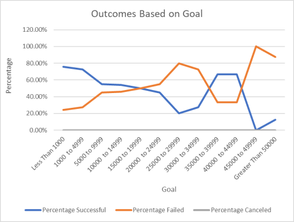

# Kickstarter-analysis
Two Excel data analyses for the crowdfunding projects

**Overview**

This is Excel data analysis on several thousand crowdfunding projects to uncover trends of the campaign' outcomes ("successful," "failed," and "canceled") based on launched date and the funding goal amount.

**Analysis and Challenges**

Herin, we have performed two data analyses: 
1. Outcomes based on launch date table and chart of crowdfunding projects

2. Outcomes based on goals table and chart of crowdfunding projects

From these analayses we have four challenges:
1. Applying filters, conditional formatting, and formulas of crowdfunding projects,
2. Generating and interpreting pivot table and chart,
3. Grouping the "Row Labels" column to show the specific time line,
4. Using a "COUNTIFS()" fuction to populate the number of success, fail and cancel based on the funding goal amount.

**Results**

Based on these analses, we can determine the following:

1.  If we filtered for only the "theater", we will find that there were highest successful theater Kickstarters in May and lowest in Decepber.
2.  There were not significant trend on faiure and canceled theater Kickstarters thrught the year.
3.  From the outcome vs. funding goal for plays, the successful rage decreases as the funding goal increases, meaning that asking for too much money may fail in fundrasing.  
4.  However, there is higher successful rate at the funding goal between $35,000 and $ 45,000. This is the most suitable, and more goals are more likely to fail.
